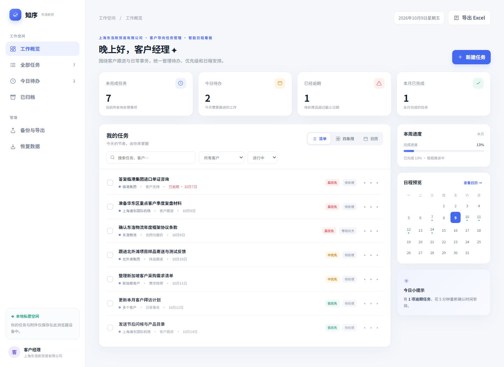

# 知序｜上海东浩新贸易有限公司客户任务与日程看板

## 项目简介

这是面向**上海东浩新贸易有限公司**客户跟进与日常事务场景制作的轻量网页 Demo。它把客户事项、处理状态、优先级和截止日期集中展示，帮助使用者快速查看今天要做的事、即将到期的跟进和需要重新安排的逾期事项。

当前版本重点是一个简单、可直接运行的看板页面，不包含复杂的 Agent 对话流程。

## 主界面预览



主界面包括：

- 左侧导航：工作概览、全部任务、今日待办、已归档，以及备份和恢复入口。
- 顶部概览：未完成、今日待办、逾期和本月完成数量；可快速新建任务。
- 任务工作区：以清单、四象限或月历查看任务，并按关键词、客户和状态筛选。
- 右侧信息栏：本月完成进度、月历预览和当日提示。

## 主要功能

- **客户任务记录**：记录任务名称、客户、事项类别、截止日期、处理状态、优先级、重要/紧急程度和备注。
- **跟进留痕**：在任务详情中添加跟进记录，查看历史沟通进展。
- **附件管理**：将小型附件关联到任务；单个附件限制为 2 MB。
- **多种任务视图**：清单适合日常处理，四象限按重要/紧急程度整理，日历用于查看和调整日期。
- **任务状态管理**：支持待处理、等待对方、已完成和归档等工作状态。
- **查询和筛选**：搜索任务与客户，筛选客户和处理状态；快速查看今天和逾期事项。
- **备份与导出**：导出 Excel 清单、备份为 JSON，并从 JSON 文件恢复数据；支持打印单项任务记录。
- **本地保存**：任务数据和附件保存在当前浏览器的本地存储中，刷新页面后仍可继续查看。

演示数据包括东浩物流年度框架协议、上海浦东国际机场客户复盘、北外滩样品跟进、临港集团单证咨询等客户事项。它们用于展示页面流程，不代表公司的真实客户记录。

## 如何打开

1. 克隆仓库或下载项目文件。
2. 双击项目根目录下的 `index.html`，使用现代浏览器打开。
3. 点击“新建任务”开始记录；数据会留在当前浏览器中。

此版本是独立 HTML 页面，样式和交互脚本都包含在 `index.html` 内，无需安装 Node.js、Python 或其他项目依赖。也可以通过本地静态网页服务器打开。

## 数据范围与当前限制

- 每位使用者的数据只保存在自己的浏览器中；克隆仓库不会带上你电脑上的任务数据，朋友也不会自动看到或同步你的任务。
- 当前没有云端数据库、用户登录、团队协作、跨设备同步、真实 AI Agent、WorkBuddy、企业微信或邮件集成。
- 页面可离线使用；字体会优先使用本机字体，在线时可能加载 Google Fonts 字体资源。
- 演示任务和公司名称用于展示项目场景，不构成真实客户或业务数据。

## 文件结构

```
.
├── index.html              # 独立运行的任务与日程看板
├── README.md               # 项目说明
└── docs/
    └── main-dashboard.png  # 主界面截图
```
